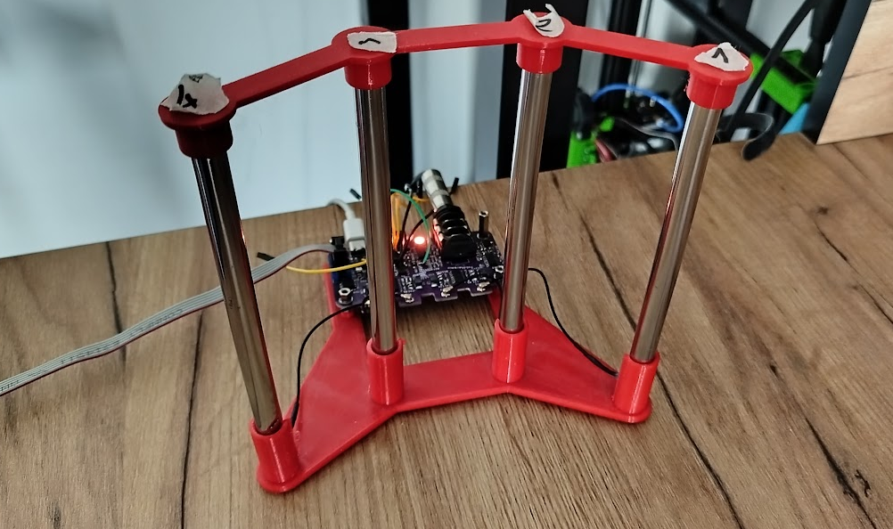

# PolyTheremin Software

## Overview

This repository contains the software implementation of the [PolyTheremin project](https://github.com/MiCyg/PolyTheremin) (Currently on the development). The code has been tested on my [testing platform](https://github.com/MiCyg/PolyTheremin_Hardware), connected to four metal antennas.
This project implements a polyphonic theremin using the RP2040 microcontroller, utilizing FreeRTOS for real-time processing and the CMSIS-DSP library for frequency calculations and calculate decorelator in future.



## Features

- [X] Detects finger positions using antennas
- [X] Scales frequencies to a musical range
- [X] Generates sound based on finger distances
- [X] Uses a button to change sounds
- [ ] Automatic scaling
- [ ] Uploading custom waveforms
- [ ] Increasing detection range
- [ ] Ddecorelator implementation

## Frequency Detection

Frequency detection is performed by measuring the time interval between each signal period. When the signal changes state, a timer starts counting until the next rising edge. An interrupt then captures the counter value and stores it in memory.


Additionally, DMA transfers these values into an buffer. Once the DMA transfer completes, an interrupt is triggered every `FREQ_DET_DMA_BUFFER_NUM` transfers. This buffer is then processed for frequency analysis and oscillators tuning.

## Capacitive Touch Calibration

Each antenna generates a digital square wave signal with a frequency between 400 kHz and 600 kHz. The `het_generator` module processes these signals by quantizing them to create a beating signal with a frequency above 10 kHz.

To calibrate the system, measure the base frequency of each antenna and define `HET_GENX_FREQ` for each channel with an offset of approximately 20 kHz.

For example, if the measured base frequencies are:

```
ANTENNA 0: 530000 Hz  
ANTENNA 1: 614000 Hz  
ANTENNA 2: 520000 Hz  
ANTENNA 3: 510000 Hz  
```

You should set:

```c
#define HET_GEN0_FREQ 550000  
#define HET_GEN1_FREQ 634000  
#define HET_GEN2_FREQ 540000  
#define HET_GEN3_FREQ 530000  
```

This calibration method is somewhat tricky, but it is the best available approach for now. Improving the calibration process is on my to-do list. 😊

## Direct Digital Synthesis

The program includes four independent oscillators mixed using the `dds` module. Each oscillator retrieves samples from a wavetable at a frequency set by a phase accumulator.

To create custom waveforms, I use the [Wave Table Generator](http://www.gaudi.ch/WaveGenerator/) and my own scripts to generate sine waves and their combinations.

## Building the Project

First, clone the repository and initialize all submodules (FreeRTOS and CMSIS) using the following commands:

```sh
git submodule init  
git submodule update  
```

There are multiple ways to build the project.

### Using VS Code Extension (Recommended)

Follow the official SDK documentation to install the [Raspberry Pi Pico VS Code extension](https://datasheets.raspberrypi.com/pico/getting-started-with-pico.pdf#vscode-extension).

Then, clone the repository and open it in Visual Studio Code. Next, import the project using the Raspberry Pi Pico badge. Select the project location and click the `Import` button. If the Pico SDK is not yet installed, the extension may take a few minutes to download and set it up.


After reloading the window, the board configuration should be loaded as `polyTheremin_board`.

### Using CMake

You can also build the project manually using CMake. Create a build folder and run `cmake` inside it:

```sh
mkdir build  
cd build  
cmake ..  
make  
```

## Contributing

Contributions to this project are welcome! Feel free to submit a pull request or create a new issue. I strive to write clean and efficient code, but code reviews and feedback are always appreciated to enhance the project further. 😊

